# Flujo de Aprobaciones — Solicitudes Indirectos

---

## Diagrama 1 — Prerequisito: Tercero

> Los terceros **no se crean en el software**. Se cargan desde un Excel externo.
> Si un tercero no cumple los requisitos, **no aparece disponible** para vincular a una solicitud.

```mermaid
flowchart TD
    A([Quiero vincular un Tercero a una Solicitud])

    A --> B{"El Tercero existe en el sistema?"}

    B -->|No| C["No se puede crear aqui\n Los terceros se cargan desde\nun Excel externo.\nContactar al area responsable\npara incluirlo en el proceso."]

    B -->|Si| D{"Tiene los datos obligatorios completos?"}

    D -->|Faltan datos| E["Completar en el software:\n- Representante Legal\n- Cedula del RL\n- Correo para Firma\n- Direccion\n- Telefono"]
    E --> F

    D -->|Completo| F{"Debida Diligencia aprobada?"}

    F -->|"No aprobada\n(no aparece en el dropdown)"|  G["Completar las 6 verificaciones:\n1. Identificacion de la contraparte\n2. Consulta en listas restrictivas\n3. Verificacion PEP\n4. Conocimiento del negocio\n5. Monitoreo y actualizacion\n6. Senales de alerta y reporte\nSe aprueba automaticamente\nal marcar las 6"]
    G --> H

    F -->|Aprobada| H{"SAGRILAFT vigente?"}

    H -->|"Vencido o sin fecha"| I["Registrar o renovar\nfechaVencimientoSagrilaft\nInformativo - no bloquea el flujo"]
    I --> Z

    H -->|Vigente| Z

    Z(["Tercero disponible para crear solicitudes"])

    style C fill:#fef2f2,color:#991b1b,stroke:#fca5a5
    style G fill:#fffbeb,color:#92400e,stroke:#fcd34d
    style I fill:#eff6ff,color:#1e40af,stroke:#93c5fd
    style Z fill:#f0fdf4,color:#166534,stroke:#86efac
```

---

## Diagrama 2 — Flujo de Aprobaciones

> Flujo de izquierda a derecha. Las lineas punteadas son devoluciones — solo el solicitante original puede reenviar.

```mermaid
flowchart LR
    BOR(["BORRADOR<br/>SOLICITANTE<br/>crea y completa la solicitud"])

    subgraph ENVIO ["Envio inicial"]
        direction TB
        TEC{Solicitante es TECNICA?}
        PEND["PENDIENTE DIRECTOR TECNICO<br/>DIRECTOR_TECNICO aprueba o devuelve"]
        TEC -->|Si| PEND
    end

    ENV["ENVIADA<br/>DIRECTOR_PROYECTO asignado al frente<br/>aprueba o devuelve"]
    TRA["EN_TRAMITE_CONTRATOS<br/>CONTRATOS Tramite asignado al frente<br/>tramita, revisa o devuelve"]
    MIN["CREACION_MINUTA<br/>CONTRATOS Minuta asignado al frente<br/>Requiere al menos 1 anexo adjunto"]
    CON["EN_CONTROLES<br/>Cualquier usuario CONTROLES<br/>Registra numero de contrato Adpro"]
    APR["APROBACION_FINAL<br/>DIRECTOR_CONTROLES asignado al frente<br/>da aprobacion final"]
    FIN(["COMPLETADA"])

    DEV["DEVUELTA<br/>Solo el solicitante original<br/>puede reenviar"]
    REV["EN_REVISION<br/>Solo el solicitante original<br/>puede reenviar"]

    BOR --> TEC
    TEC -->|No| ENV
    PEND -->|APROBAR| ENV
    PEND -->|DEVOLVER + nota| DEV

    ENV -->|APROBAR_DIRECTOR| TRA
    ENV -->|DEVOLVER + nota| DEV

    TRA -->|TRAMITAR_OK| MIN
    TRA -->|REVISAR + nota| REV
    TRA -->|DEVOLVER + nota| DEV

    MIN -->|AVANZAR_CONTRATOS| CON
    CON -->|REGISTRAR_ADPRO| APR
    APR -->|APROBAR_FINAL| FIN

    DEV -. REENVIAR .-> ENV
    REV -. REENVIAR .-> ENV

    style BOR fill:#64748b,color:#fff,stroke:#475569
    style ENV fill:#2563eb,color:#fff,stroke:#1d4ed8
    style TRA fill:#7c3aed,color:#fff,stroke:#6d28d9
    style MIN fill:#7c3aed,color:#fff,stroke:#6d28d9
    style CON fill:#0891b2,color:#fff,stroke:#0e7490
    style APR fill:#0369a1,color:#fff,stroke:#075985
    style FIN fill:#16a34a,color:#fff,stroke:#15803d
    style PEND fill:#9333ea,color:#fff,stroke:#7e22ce
    style DEV fill:#dc2626,color:#fff,stroke:#b91c1c
    style REV fill:#d97706,color:#fff,stroke:#b45309
```



---

## Resumen — Quien hace que

| Estado | Accion | Rol requerido | Requisito extra |
|---|---|---|---|
| `BORRADOR` | `ENVIAR` | SOLICITANTE | Campos obligatorios + minimo 1 frente |
| `PENDIENTE_DIRECTOR_TECNICO` | `APROBAR` / `DEVOLVER` | DIRECTOR_TECNICO | Nota obligatoria si devuelve |
| `ENVIADA` | `APROBAR_DIRECTOR` / `DEVOLVER` | DIRECTOR_PROYECTO (asignado al frente) | Nota obligatoria si devuelve |
| `EN_TRAMITE_CONTRATOS` | `TRAMITAR_OK` / `REVISAR` / `DEVOLVER` | CONTRATOS Tramite (asignado al frente) | Nota obligatoria si devuelve o revisa |
| `CREACION_MINUTA` | `AVANZAR_CONTRATOS` | CONTRATOS Minuta (asignado al frente) | Al menos 1 archivo en Anexos |
| `EN_CONTROLES` | `REGISTRAR_ADPRO` | Cualquier usuario CONTROLES | Numero de contrato Adpro obligatorio |
| `APROBACION_FINAL` | `APROBAR_FINAL` | DIRECTOR_CONTROLES (asignado al frente) | - |
| `DEVUELTA` / `EN_REVISION` | `REENVIAR` | Solo el solicitante original | - |

## Reglas de negocio clave

- **Terceros**: vienen de un Excel externo, no se crean en el software. Solo aparecen disponibles si `aprobadoDebidaDiligencia = true` (las 6 verificaciones DD completadas).
- **SAGRILAFT**: si `fechaVencimientoSagrilaft` esta vencida o no registrada, el tercero **no puede usarse** — debe renovarse primero.
- **Cronograma**: `fechaInicio` debe ser minimo 13 dias habiles desde hoy (calendario Colombia).
- **Devolver / Revisar**: siempre requieren nota obligatoria explicando el motivo.
- **Avanzar a Controles**: debe haber al menos 1 archivo cargado en Anexos.
- **Registrar Adpro**: el numero de contrato Adpro es obligatorio.
- **ADMIN**: bypasea todas las restricciones de rol y permiso.
